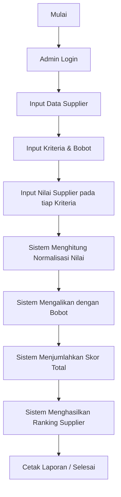

<h1 align="center">Sistem Pendukung Keputusan Pemilihan Supplier Biji Kopi</h1>
<h3 align="center">Menggunakan Metode SMART (Simple Multi-Attribute Rating Technique)</h3>

<p align="center">
  
  
  
  
</p>

---

## 📖 1. Deskripsi Proyek
Proyek ini adalah sebuah website **Sistem Pendukung Keputusan (SPK)** yang dirancang untuk membantu pemilik *coffee shop* dalam memilih supplier biji kopi terbaik. Sistem ini menggunakan metode **SMART** untuk memberikan penilaian objektif dan akurat terhadap berbagai kandidat supplier berdasarkan kriteria yang telah ditentukan oleh bisnis.

## 🤔 2. Latar Belakang Permasalahan
Kualitas biji kopi adalah nyawa dari sebuah bisnis *coffee shop*. Seringkali, pemilik kebingungan memilih supplier karena banyak variabel yang harus dipertimbangkan (misalnya: harga murah vs kualitas bagus vs pengiriman cepat). Jika keputusan hanya didasarkan pada *feeling* atau harga semata, hal ini dapat menyebabkan ketidakkonsistenan rasa kopi yang berujung pada kekecewaan pelanggan. Oleh karena itu, dibutuhkan sebuah sistem yang dapat menghitung dan menyeimbangkan semua kriteria secara adil dan matematis.

## 🎯 3. Tujuan Pembangunan Sistem
- Memberikan rekomendasi supplier biji kopi terbaik secara objektif.
- Meminimalisir kesalahan manusia (*human error*) dan subjektivitas dalam pemilihan supplier.
- Mempercepat proses pengambilan keputusan bisnis.
- Menyediakan riwayat evaluasi performa supplier secara terstruktur dan terdokumentasi.

## ✨ 4. Fitur Utama Aplikasi
- 🔐 **Autentikasi Aman:** Sistem Login khusus untuk Admin/Pemilik.
- ⚖️ **Manajemen Kriteria:** Tambah, edit, dan atur bobot (persentase) kriteria penilaian.
- 👥 **Manajemen Supplier (Alternatif):** Kelola data kandidat supplier yang akan dievaluasi.
- 📝 **Penilaian Fleksibel:** Input nilai performa tiap supplier berdasarkan masing-masing kriteria.
- ⚙️ **Kalkulator SMART Otomatis:** Sistem secara *real-time* menormalkan nilai dan mengalikannya dengan bobot.
- 🏆 **Laporan & Ranking:** Menampilkan hasil akhir berupa urutan supplier dari skor tertinggi hingga terendah, dilengkapi fitur cetak (Print/PDF).

## 🛠️ 5. Teknologi yang Digunakan
Sistem ini dibangun menggunakan arsitektur modern dan standar industri:
- **Framework Backend:** Laravel 13 (PHP)
- **Database:** MySQL
- **Frontend / UI:** Bootstrap 5, HTML5, CSS3
- **Interaktivitas:** JavaScript (Vanilla / jQuery), SweetAlert2
- **Desain Pattern:** MVC & Repository Pattern (untuk abstraksi database)

## 📊 6. Tentang Metode SMART
**SMART (Simple Multi-Attribute Rating Technique)** adalah metode pengambilan keputusan multi-kriteria yang didasarkan pada teori bahwa setiap alternatif (supplier) terdiri dari sejumlah kriteria yang memiliki nilai bobot yang berbeda. SMART bekerja dengan menormalkan skala setiap kriteria agar setara, lalu mengalikannya dengan bobot prioritas.

## 🔄 7. Alur Kerja Sistem



## 📁 8. Struktur Folder Utama
```text
spk_perhitungan-metode-SMART/
├── app/
│   ├── Http/Controllers/   # Berisi controller logika aplikasi
│   ├── Models/             # Representasi tabel database
│   └── Repositories/       # Pola Repository untuk query database
├── bootstrap/              # File cache framework
├── config/                 # Konfigurasi sistem
├── database/
│   ├── migrations/         # Skema database
│   └── seeders/            # Data dummy/awal
├── public/                 # File aset (CSS, JS, Images)
├── resources/
│   └── views/              # Tampilan UI (Blade Templates)
├── routes/
│   └── web.php             # Pengaturan URL aplikasi
├── .env.example            # Contoh pengaturan environment
└── README.md               # Dokumentasi proyek
```

## 🚀 9. Panduan Instalasi (Localhost)
Ikuti langkah-langkah berikut untuk menjalankan aplikasi di komputer lokal:

1. **Clone repository ini**
   ```bash
   git clone https://github.com/tasykiaananda/spk_perhitungan-metode-SMART.git
   cd spk_perhitungan-metode-SMART
   ```

2. **Install dependensi PHP via Composer**
   ```bash
   composer install
   ```

3. **Copy file environment**
   ```bash
   cp .env.example .env
   ```

4. **Generate Application Key**
   ```bash
   php artisan key:generate
   ```

5. **Konfigurasi Database**
   Buka file `.env` dan sesuaikan koneksi database Anda (biasanya bawaan XAMPP/Laragon):
   ```env
   DB_CONNECTION=mysql
   DB_HOST=127.0.0.1
   DB_PORT=3306
   DB_DATABASE=db_spk_kopi
   DB_USERNAME=root
   DB_PASSWORD=
   ```
   *(Pastikan Anda sudah membuat database kosong bernama `db_spk_kopi` di MySQL/PhpMyAdmin).*

6. **Jalankan Migrasi dan Seeder**
   ```bash
   php artisan migrate --seed
   ```

7. **Jalankan Server Lokal**
   ```bash
   php artisan serve
   ```
   Buka browser Anda dan akses: `http://localhost:8000`

## 📸 10. Tampilan Aplikasi

| Halaman | Screenshot |
|---------|------------|
| **1. Login Admin** |
| **2. Dashboard** |
| **3. Data Supplier** | 
| **4. Data Kriteria** |
| **5. Penilaian** | 
| **6. Hasil SMART** | 
| **7. Ranking Akhir** | 


## 📑 11. Penjelasan Menu Utama
- 🏠 **Dashboard:** Menampilkan ringkasan data statistik jumlah kriteria, supplier, dan pengguna.
- ⚙️ **Data Kriteria:** Tempat untuk menentukan faktor-faktor penilaian (Cost/Benefit) beserta bobot prioritasnya.
- 📦 **Data Alternatif:** Tempat mendaftarkan nama dan kontak supplier yang akan diseleksi.
- ✍️ **Penilaian:** Form matriks untuk memberikan skor angka kepada masing-masing supplier pada setiap kriteria.
- 🧮 **Perhitungan SMART:** Halaman transparan yang memperlihatkan detail proses matematika (Normalisasi & Perkalian).
- 🏆 **Ranking:** Halaman yang menampilkan urutan supplier juara beserta fitur cetak laporan.

## 🗄️ 12. Struktur Database Singkat
- `users`: Menyimpan data login admin sistem.
- `criterias`: Menyimpan nama kriteria, tipe (Cost/Benefit), dan bobot persentase.
- `alternatives` (Suppliers): Menyimpan profil kandidat supplier.
- `assessments`: Tabel relasi (*pivot*) yang menyimpan skor antara alternatif dan kriteria.

## 🧠 13. Cara Kerja Metode SMART (Secara Sederhana)
Sistem ini bekerja seperti seorang juri lomba yang objektif:
1. **Penyetaraan (Normalisasi):** Juri harus menyamakan skala (misalnya skala jutaan rupiah disamakan dengan skala 1-100). Sistem mengubah semua nilai asli menjadi desimal (0-1) agar setara dan adil.
2. **Perkalian Bobot:** Juri mengalikan nilai yang sudah setara dengan persentase prioritas kriteria. Jika "Kualitas" lebih prioritas dari "Jarak", nilainya dikalikan bobot yang lebih besar.
3. **Total:** Semua poin dari tiap kriteria dijumlahkan menjadi **1 Skor Total Akhir**.

## 🧮 14. Contoh Proses Perhitungan Singkat
Misal **Kualitas** bobotnya 50% dan **Harga** bobotnya 30%.
Sistem menormalkan nilai kualitas Supplier A menjadi 0.8 dan Harga menjadi 0.7.
- Kualitas: `0.8 x 50% = 0.40`
- Harga: `0.7 x 30% = 0.21`
**Skor Total A:** `0.40 + 0.21` = **0.61**

## 🏆 15. Hasil Akhir Sistem
Keluaran dari sistem ini adalah tabel rekomendasi *ranking*. Sistem akan memberitahu pemilik *coffee shop*: *"Supplier X adalah rekomendasi terbaik dengan skor tertinggi"*, sehingga keputusan bisnis bisa diambil dengan cepat dan berbasis data.

## 🚀 16. Pengembangan Masa Depan
Beberapa fitur yang dapat ditambahkan di masa depan:
- [ ] Fitur notifikasi sistem (Email/WhatsApp) ke supplier terpilih.
- [ ] Integrasi otomatis dengan sistem inventaris stok gudang.
- [ ] Penambahan grafik/visualisasi histori tren performa supplier bulanan.
- [ ] Pengembangan UI/UX versi *mobile friendly* (PWA).

## 👥 17. Kontributor
- **Tasykia Ananda** - *Lead Developer / Peneliti* - [@tasykiaananda](https://github.com/tasykiaananda)

## 📜 18. Lisensi
Didistribusikan di bawah **MIT License**. Silakan lihat `LICENSE` untuk informasi lebih lanjut.

---
<p align="center">
  Dibuat dengan ❤️ untuk kemajuan industri kopi Indonesia.<br>
  © 2026 <b>Sistem Pendukung Keputusan Kopi</b> - All Rights Reserved.
</p>
